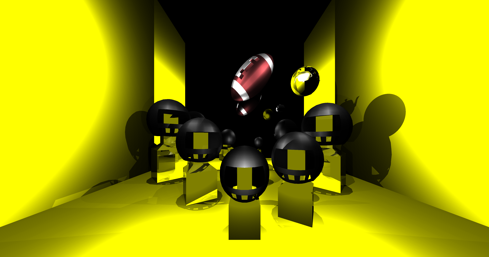
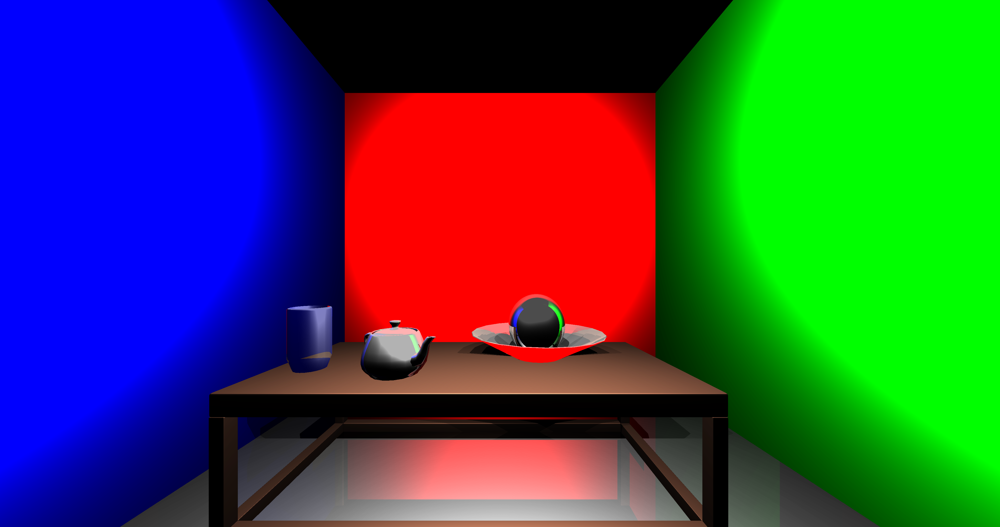
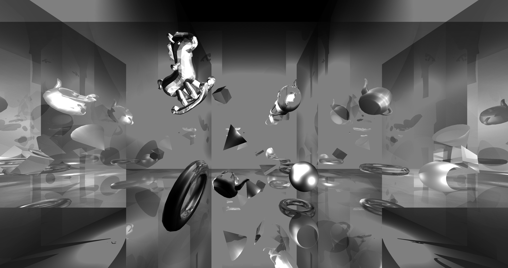

# Java Ray Tracer

This project is a fully functional ray tracer implemented in Java, built from scratch without external frameworks. It demonstrates advanced rendering techniques and supports creating photorealistic images by defining scenes programmatically.

---

## 🌟 Features

- **Blinn-Phong Shading**: Adds realistic shininess to objects.
- **Reflection and Refraction**: Simulates light bouncing and passing through transparent objects.
- **Transformations**: Supports object rotation and scaling.
- **OBJ Reader**: Integrated loader for 3D object files.
- **Customizable Scenes**: Define and render your own scenes directly in the code.

---

## 🚀 Getting Started

### Prerequisites
- **Java Development Kit (JDK)**: Version 8 or higher.
- **IDE/Text Editor**: IntelliJ IDEA, Eclipse, or any text editor.

### Installation
1. Clone the repository:
    ```bash
    git clone https://github.com/DemianVGLl2/Raytracer-Java-Project.git
    cd Raytracer-Java-Project
    ```
2. Open the project in your preferred IDE.
3. Build the project.

---

## 📐 Creating a Scene

You can create and render a custom scene by editing the `RayTracer.java` file. Here's an example of a basic setup:

```java
public static void main(String[] args) {
    System.out.println(new Date());
    Scene scene01 = new Scene();
    scene01.setCamera(new Camera(new Vector3D(0, 0, -4), 80, 80, 800, 800, 2, 60));
    // Define your scene objects here

    raytrace(scene01);
    FileManager.saveImage(image, "image_output", "png");
}
```
## Define Objects in the Scene

To create a custom scene, add objects to the `scene01` object, specifying their properties such as position, color, and transformations. For complex models, use the `OBJReader` to load 3D objects. Example:

```java
// Adding objects to the scene
scene01.addObject(new Sphere(new Vector3D(0, 0, 10), 2, Color.RED));
scene01.addObject(new DirectionalLight(new Vector3D(1, -1, -1), Color.WHITE, 0.8));
```

## 🎨 Example Output

Here are three rendered scenes created with the ray tracer:

1. **Simple Sphere Scene**  
   

2. **Reflection and Refraction Example**  
   

3. **Complex Model with OBJ Loader**  
   

---

## 📚 Project Structure

- **`Scene`**: Contains definitions for the camera, lights, and objects.
- **`RayTracer.java`**: Entry point for configuring and rendering scenes.
- **`FileManager`**: Handles saving rendered images to disk.
- **`OBJReader`**: Loads 3D models for inclusion in scenes.

---

## 💡 Rendering Techniques

- **Blinn-Phong Model**: For realistic light interaction on surfaces.
- **Recursive Ray Tracing**: For accurate reflection and refraction effects.
- **Transformations**: Rotate and scale objects within the scene.

---

## 🛡️ Usage Notes

- Rendering large scenes or high-resolution images may take time depending on your system's performance.
- Ensure sufficient memory allocation if handling large OBJ files.

---

## 📧 Contact

For questions or suggestions, feel free to reach out:

**Email**: 0252028@up.edu.mx  
**Authors**:  
- Jafet  
- Demián  

---

## 📜 License

This project is open-source and available under the [MIT License](LICENSE).
