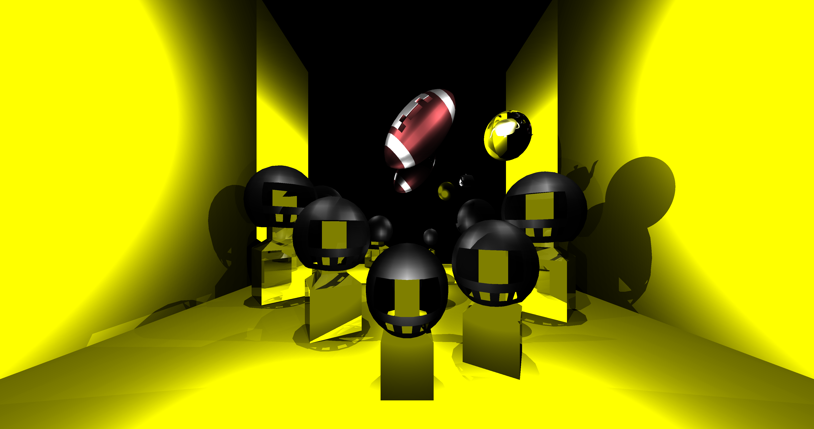
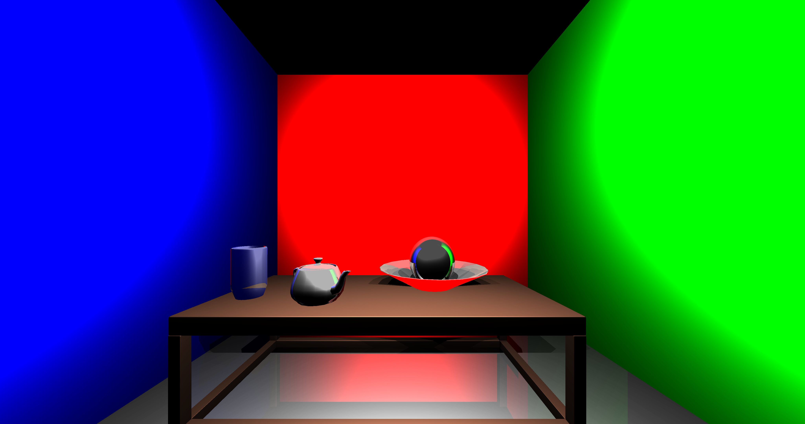
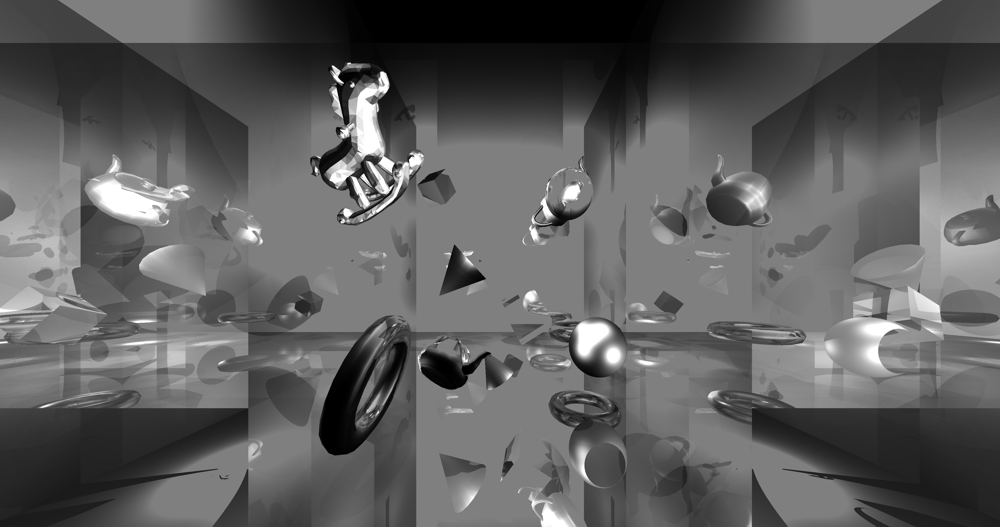

# Java Ray Tracer

This project is a fully functional ray tracer implemented in Java, built from scratch without external frameworks. It demonstrates advanced rendering techniques and supports creating photorealistic images by defining scenes programmatically.

---

## 🌟 Features

- **Blinn-Phong Shading**: Adds realistic shininess to objects.
- **Reflection and Refraction**: Simulates light bouncing and passing through transparent objects.
- **Transformations**: Supports object rotation and scaling.
- **OBJ Reader**: Integrated loader for 3D object files.
- **Customizable Scenes**: Define and render your own scenes directly in the code.

---

## 🚀 Getting Started

### Prerequisites
- **Java Development Kit (JDK)**: Version 8 or higher.
- **IDE/Text Editor**: IntelliJ IDEA, Eclipse, or any text editor.

### Installation
1. Clone the repository:
    ```bash
    git clone https://github.com/DemianVGLl2/Raytracer-Java-Project.git
    cd Raytracer-Java-Project
    ```
2. Open the project in your preferred IDE.
3. Build the project.

---

## 🧭 How to Run (IDE or Console)

> If you don’t have IntelliJ and want to run it from your console, follow **Option B** below.

### ✅ Option A — Run with IntelliJ (IDE)
1. Open the project folder in **IntelliJ IDEA**.  
2. Ensure the Project SDK is set (JDK 8+).  
3. Run the `main` method in `edu.up.isgc.cg.raytracer.Raytracer`.  

> IntelliJ uses the project root as the working directory, so relative `.obj` files resolve correctly.

### 🔧 Option B — Run from Console (No IDE)

Run these **from the repository root** (the folder that contains `src/` and the `.obj` files like `JafetToyHorse.obj`, `Wall.obj`, etc.).

#### Windows — PowerShell
```powershell
# 1) Create output folder
New-Item -ItemType Directory -Force -Path out | Out-Null

# 2) Generate javac argfile with quoted POSIX-style paths and no BOM
Get-ChildItem -Recurse -Path src -Filter *.java |
  ForEach-Object { '"{0}"' -f ( $_.FullName -replace '\\','/' ) } |
  Out-File -Encoding ascii sources.txt

# 3) Compile (use CMD so PowerShell doesn't treat @ as splatting)
cmd /c "javac -encoding UTF-8 -d out @sources.txt"

# 4) Run
java -cp out edu.up.isgc.cg.raytracer.Raytracer
```

#### macOS / Linux / WSL
```bash
rm -rf out && mkdir out
find src -name "*.java" > sources.txt
javac -encoding UTF-8 -d out @sources.txt
java -cp out edu.up.isgc.cg.raytracer.Raytracer
```

> **WSL tip:** Run these commands inside your WSL filesystem (e.g., `~/projects/Raytracer_Project`) to avoid Windows path quirks.

---

## 🧪 Troubleshooting

- **`java.io.FileNotFoundException: <something>.obj`**  
  Run the program **from the project root**, where the `.obj` files live. Avoid absolute paths outside the repo.

- **Windows: `invalid flag: G:/Mi ...` or `invalid flag: ?G:/Mi ...`**  
  Your `sources.txt` must be:
  - **Quoted** (each line wrapped in `"..."`)  
  - **No BOM** (use `Out-File -Encoding ascii`)  
  - **Forward slashes `/`** instead of backslashes `\`  
  Regenerate it with the exact PowerShell block above.

- **NullPointerException in raycast**  
  Usually means a model failed to load. Fix the `.obj` path issue above; consider adding fail-fast checks in the OBJ loader.

---

## 📐 Creating a Scene

You can create and render a custom scene by editing the `RayTracer.java` file. Here's an example of a basic setup:

```java
public static void main(String[] args) {
    System.out.println(new Date());
    Scene scene01 = new Scene();
    scene01.setCamera(new Camera(new Vector3D(0, 0, -4), 80, 80, 800, 800, 2, 60));
    // Define your scene objects here

    raytrace(scene01);
    FileManager.saveImage(image, "image_output", "png");
}
```

## Define Objects in the Scene

To create a custom scene, add objects to the `scene01` object, specifying their properties such as position, color, and transformations. For complex models, use the `OBJReader` to load 3D objects. Example:

```java
// Adding objects to the scene
scene01.addObject(new Sphere(new Vector3D(0, 0, 10), 2, Color.RED));
scene01.addObject(new DirectionalLight(new Vector3D(1, -1, -1), Color.WHITE, 0.8));
```

---

## 🎨 Example Output

1. **Render 1**  
   

2. **Render 2**  
   

3. **Render 3**  
   

---

## 📚 Project Structure

- **`Scene`**: Contains definitions for the camera, lights, and objects.
- **`RayTracer.java`**: Entry point for configuring and rendering scenes.
- **`FileManager`**: Handles saving rendered images to disk.
- **`OBJReader`**: Loads 3D models for inclusion in scenes.

---

## 💡 Rendering Techniques

- **Blinn-Phong Model**: For realistic light interaction on surfaces.
- **Recursive Ray Tracing**: For accurate reflection and refraction effects.
- **Transformations**: Rotate and scale objects within the scene.

---

## 🛡️ Usage Notes

- Rendering large scenes or high-resolution images may take time depending on your system's performance.
- Ensure sufficient memory allocation if handling large OBJ files.

---

## 📦 .gitignore (recommended)
Add this to avoid committing build artifacts:
```
out/
sources.txt
```

---

## ℹ️ Why it worked in IntelliJ but failed in the console

- **Working Directory**: IntelliJ runs from the project root, so relative `.obj` paths (e.g., `"JafetToyHorse.obj"`) resolve correctly. In a console, if you run from another folder, those files aren’t found.  
- **Windows Argfile Quirks**: `javac @sources.txt` breaks if the argfile has backslashes, spaces without quotes, or a BOM. The PowerShell recipe above generates a safe `sources.txt` (quoted, no BOM, forward slashes).

---

## 📧 Contact

For questions or suggestions, feel free to reach out:

**Email**: 0253139@up.edu.mx

---

## 🎓 Acknowledgments

This project was developed as part of the **Multimedia and Computer Graphics** course in the **Bachelor of Systems Engineering and Computer Science** program.

Special thanks to my teacher **Jafet Rodríguez** for their guidance and support throughout the development of this ray tracer.
